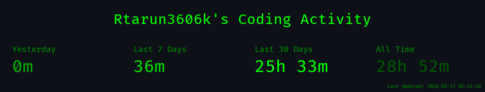
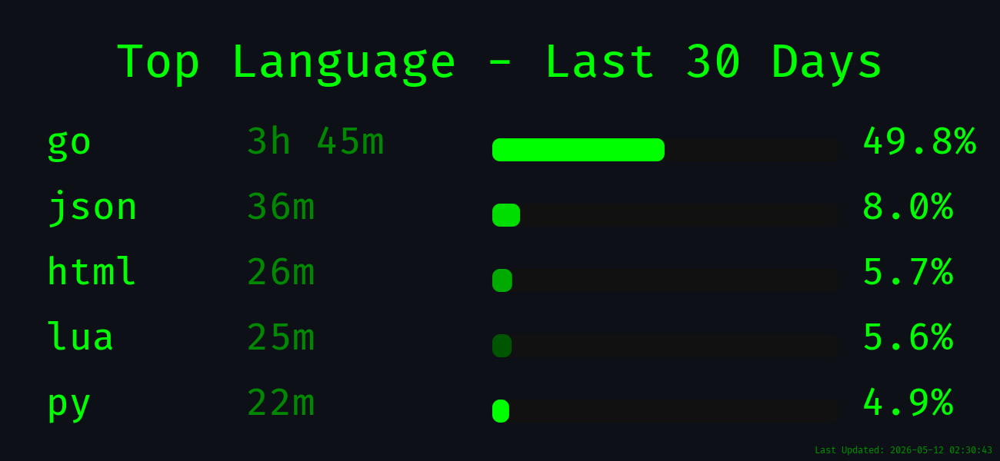
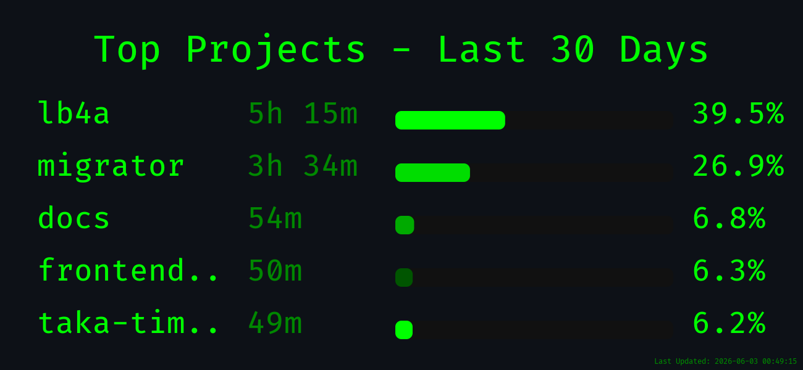
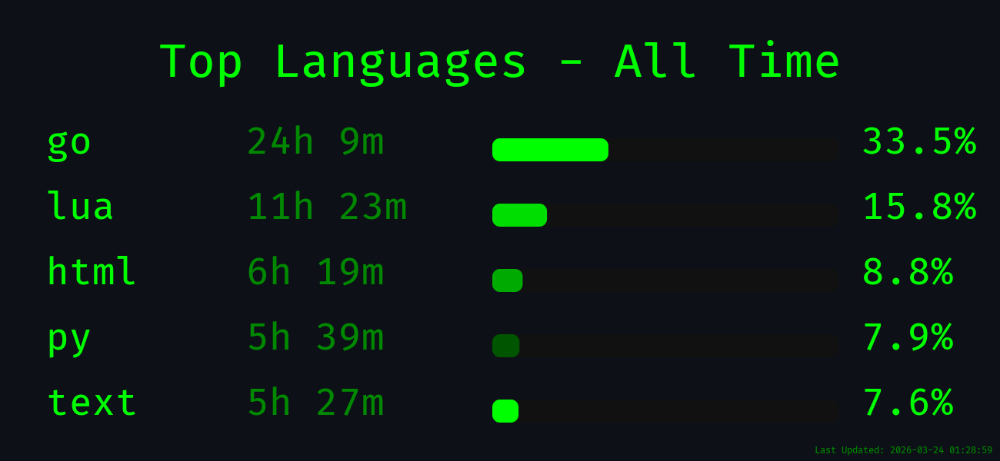
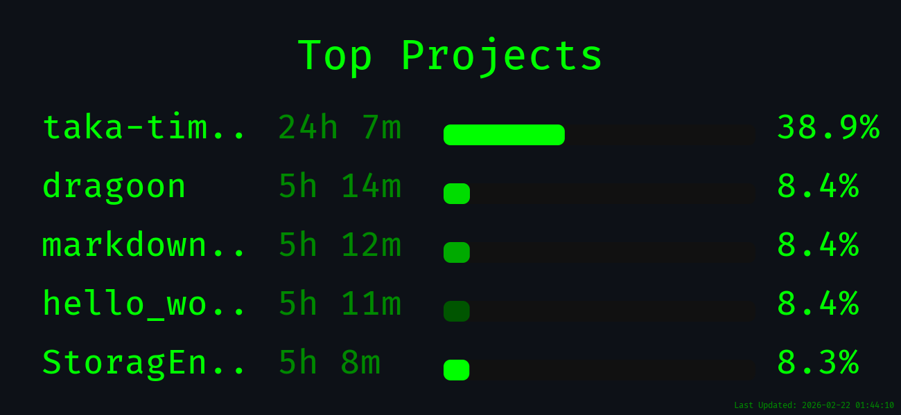
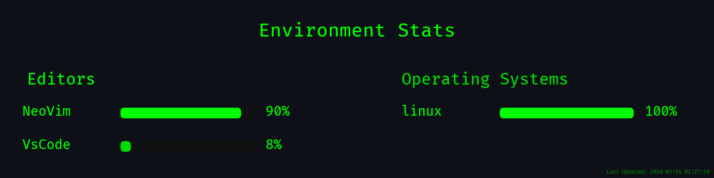

 
<!--  -->

  # TakaTime

  **The Open Source, Self-Hosted WakaTime Alternative.**
   
  <i>"Time is what we want most, but what we use worst."</i>

    

  

  

   

  
  
  
  

   

  
  
  

  
  
<!-- <iframe width="245px" height="48px" src="https://plugins.jetbrains.com/embeddable/install/31861"></iframe> -->

 

<!--takatime-start-->

<h2 align="center">TakaTime Weekly Report</h2>

   
  
   
  
   
  

<em>Generated automatically by <a href="https://github.com/Rtarun3606k/TakaTime">TakaTime</a></em>

<!--takatime-end-->

---

## Official Documentation & Setup

**[Click here to visit the TakaTime Wiki](https://github.com/Rtarun3606k/TakaTime/wiki)** for complete installation guides, database setup (BYODB), dashboard commands, and theme customization.

---

###  Visual Theme Generator
Tired of manually configuring command-line flags? Use the **[Interactive TakaTime Generator](https://rtarun3606k.github.io/TakaTime/)** to visually customize your stats card, preview themes in real-time, and instantly copy the exact Markdown snippet you need for your GitHub Profile.

---

##  Interactive Terminal Dashboard

TakaTime includes a fully interactive, offline-first terminal dashboard directly inside your editor. View your coding stats, language breakdowns, and project times without ever leaving your workflow or opening a browser.

  <!-- 
  
  
<em>TakaTime Dashboard running locally in Neovim (left) and VS Code (right)</em>
 -->
 

---

##  Features

- **Non-Blocking Architecture:** Engineered in Go with asynchronous concurrency. Data synchronization occurs entirely in the background, ensuring zero latency impact on your editor's performance.
- **Bring Your Own Database (BYODB):** Data is persisted exclusively to your personal MongoDB instance. This ensures complete data ownership with no third-party tracking or subscription fees.
- **Granular Telemetry:** Intelligently tracks and categorizes development activity by project, programming language, and file type without requiring manual configuration.
- **GitHub Profile Integration:** Automatically generate high-resolution statistical charts for your GitHub Profile README via GitHub Actions.

---
## 🎨 Themes

TakaTime includes 18 built-in color themes. Browse the full visual gallery — including Terminal Dashboard and Web Generator previews for each theme — in **[THEMES.md](./THEMES.md)**.

##  Editor Compatibility 

TakaTime is cross-platform and editor-agnostic. All plugins share the same core Go binaries for a consistent experience.

<table>
  <tr>
    <th>Feature</th>
    <th>Neovim</th>
    <th>VS Code</th>
    <th>Antigravity</th>
    <th>JetBrains</th>
    <th>OS Support</th>
  </tr>
  <tr>
    <td><b>Background Sync</b></td>
    <td>✓ Supported</td>
    <td>✓ Supported</td>
    <td>✓ Supported</td>
    <td>✓ Supported</td>
    <td>Win, Mac, Linux</td>
  </tr>
  <tr>
    <td><b>Terminal Dashboard</b></td>
    <td>✓ Supported</td>
    <td>✓ Supported</td>
    <td>✓ Supported</td>
    <td>✓ Supported</td>
    <td>Win, Mac, Linux</td>
  </tr>
  <tr>
    <td><b>Profile Stats</b></td>
    <td>✓ Supported</td>
    <td>✓ Supported</td>
    <td>✓ Supported</td>
    <td>✓ Supported</td>
    <td>Win, Mac, Linux</td>
  </tr>
  <tr>
    <td><b>Privacy Controls</b></td>
    <td>✓ Supported</td>
    <td>⚙ Planned</td>
    <td>⚙ Planned</td>
    <td>⚙ Planned</td>
    <td>All OS</td>
  </tr>
</table>

---

##  Architecture

  <table border="0">
    <tr>
      <th align="center">High-Level Architecture</th>
      <th align="center">Zero-Latency Flow</th>
    </tr>
    <tr>
      <td width="50%" valign="top">
        
      </td>
      <td width="50%" valign="top">
        
      </td>
    </tr>
  </table>

---

## Contributors & Community

We welcome pull requests! Whether you want to add support for a new IDE or a new TUI theme, check out our <a href="https://github.com/Rtarun3606k/TakaTime/blob/main/CONTRIBUTING.md">Contribution Guidelines</a>.

  

---

**License:** MIT License. See `LICENSE` for details.

